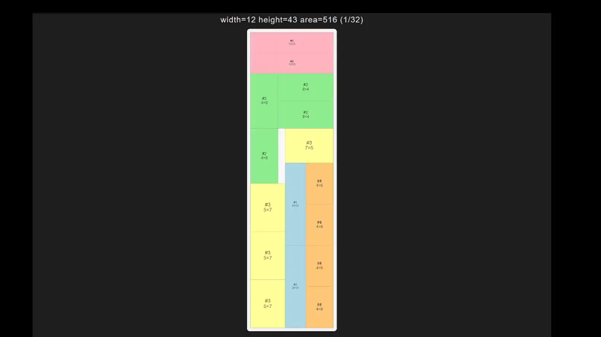

# Guillotine Cutting 2D

Rust library and CLI tool for 2D guillotine cutting stock problems.

## What it does

Given a stock sheet size and a list of rectangular pieces,
the problem is to find placements that minimize the number
of sheets used (ties broken by the used area on the last sheet).
Some (or all) pieces can be specified as rotatable.
All cuts are guillotine cuts, i.e. straight lines across the full remaining rectangle.

## Example

The `glf_sweep` example computes the provably optimal 1-sheet layout for every feasible
width using the GLF algorithm, then renders each layout as an SVG:

```bash
cargo run --example glf_sweep --release
# open tmp/index.html in a browser
```

Each frame below is the optimal placement for that sheet width.
The problem is NP-hard, so for the large inputs the computation is impossible;
the GA finds the approximation instead.


## Distinctive features

- Enforces **guillotine**-cut constraints.
- **Kerf** — blade thickness subtracted from each internal cut; sheet boundary edges are exempt.
  Internally baked into piece and sheet dimensions in `expand_problem`.
- **Margin** — border excluded from all four sheet edges before solving;
  output coordinates are shifted back by `+margin`.
- Exact single-sheet optimization via **GLF** (Guillotine Layout Function) — a DP on step functions over
  all guillotine-cut subsets. Supports piece rotation.
- **GA** — evolutionary (genetic) algorithm that searches for a good genome. Operators: OX/CX
  crossover, swap/flip/point-selector mutation. Configured via `GaConfig`.
- Deterministic **Decoder**: given a genome and a problem, produces a `Solution`
  via the Shorter Leftover Axis (SLAS) guillotine heuristic.
- Explicit **Genome** data structure — ordered list of `Gene` values, one per piece. Defines placement order,
  rotation preference, and which free rectangle to try first (`point_selector`).
  Suitable as an individual in a genetic algorithm.
- Problem instance **Generator** — creates random problem instances with a known optimal solution.
  Applies guillotine-cut passes to `sheets_count` blank sheets, producing a set of pieces
  that tile those sheets exactly. Useful for benchmarking the GA against a ground truth.
- Cross-platform self-contained console executable - the solver that receives the JSON
  specifying the problem instance and produces JSON with the solution.
  - **Problem** — stock sheet dimensions, blade kerf, and an ordered list of `Piece` values.
    Each piece has an opaque external label, dimensions, and a rotation flag.
    Pieces are addressed internally by their 0-based index in the list.
  - **Solution** — vector of placements + vector of free rectangles.
- _Not a black box_: the algorithm exposes a progress feedback channel `ProgressSink`
  and cancellation via `GaHandle`.
  - `FifoSink` uses FIFO under Linux (via `mkfifo`).
  - `WindowsPipeSink` uses named pipes under Windows.
  - `StdoutSink` is a no-op sink for use without a feedback channel.
  - Microsoft Excel integration: the executable can be (and is) used as the solver
    in an Excel spreadsheet (or any other external system) thanks to the JSON console interface.
    AutoCAD export is also supported.
- The `serve` mode provides an easy way for small in-house deployments.


## Usage

- You can run it in the console to solve a problem and print the best solution found in 5000 iterations of GA (`--gens 5000`)
```
cargo run --release -- calc --compact "2600x1800F:3:400x400/6,495x495/6,270x320/10,150x450/17r" --sink stdout --seed 42 --gens 5000
```

- Alternatively, you can pass a JSON file
```
bat -p task.json
  {
    "sheet": {"width": 2600, "height": 1800},
    "kerf": 3,
    "pieces": [
      {"name": "A", "width": 400, "height": 400, "count": 6, "can_rotate": false},
      {"name": "B", "width": 495, "height": 495, "count": 6, "can_rotate": false},
      {"name": "C", "width": 270, "height": 320, "count": 10, "can_rotate": false},
      {"name": "D", "width": 150, "height": 450, "count": 17, "can_rotate": true}
    ]
  }

cargo run --release -- calc --json task.json --sink stdout --seed 42 --gens 5000
```

- Or you can start the web UI at http://localhost:8080
```
cargo run --release -- serve --port 8080
```

- Or (under Windows) you can run the [Excel workbook](excel/workbook.xls).


- Finally, you can use the library directly:
```rust
use std::sync::Arc;
use cutting::{
    decoder::decode_spec,
    ga::{GaConfig, GaEvent, ga_channel, run_ga_mt},
    parse::parse_problem,
};

fn main() {
    let spec = Arc::new(
        parse_problem("3000x4000R:7:835x620/4,1020x620/4f,1750x900").unwrap()
    );
    let cfg = Arc::new(GaConfig {
        pop_size: 200, n_generations: 1000, n_elite: 5, tournament_k: 5,
        crossover_p: 0.80, swap_p: 0.15, flip_p: 0.05,
        point_p: 0.10, point_delta: (1, 3),
    });

    // Run 8 independent GA islands (one per seed) in parallel
    let seeds: Vec<u64> = (0..8).collect();
    let (mut handle, ctx) = ga_channel(0); // 0 = no progress events
    run_ga_mt(Arc::clone(&spec), Arc::clone(&cfg), seeds, ctx);

    // Block until all islands finish; results are sorted best-first
    let results = loop {
        match handle.rx.blocking_recv() {
            Some(GaEvent::Done(r)) => break r,
            _ => {}
        }
    };

    let (best_seed, best_ind) = &results[0];
    let solution = decode_spec(&spec, &best_ind.genome);
    let sheets = solution.sheets_used();
    println!("seed={best_seed}  {sheets} sheet(s)");
}
```

## Input format for the parser

`parse_problem` accepts a compact string: `"<sheet>:<kerf>:<pieces>"`.

- `<sheet>` — `WxHR` or `WxHF` in mm; the suffix sets the **default rotation** for pieces:
  - `R` — pieces are rotatable by default
  - `F` — pieces are fixed (no rotation) by default
- `<kerf>` — blade kerf width in mm (non-negative integer)
- `<pieces>` — comma-separated piece tokens; per-piece suffix overrides the sheet default:

| Piece token | Meaning                                        |
|-------------|------------------------------------------------|
| `WxH`       | one piece, rotation = sheet default            |
| `WxH/N`     | N identical pieces, rotation = sheet default   |
| `WxHr`      | one piece, **rotatable** (overrides default)   |
| `WxHf`      | one piece, **fixed** (overrides default)       |
| `WxH/Nr`    | N pieces, rotatable                            |
| `WxH/Nf`    | N pieces, fixed                                |

To control the orientation of a fixed piece, put the shorter side first or last as desired:
`620x1020` places 620 mm along X and 1020 mm along Y.

Examples:
- `"3000x4000R:7:835x620/4,1020x620/4f,1750x900"` — R default; only the `1020x620` batch is fixed
- `"2600x1800F:3:400x400/6,495x495/6,270x320/10,150x450/17r"` — F default; only `150x450` is rotatable


## Development commands

```
cargo build
cargo test
cargo test <test_name>                              # single test
cargo clippy -- -D warnings
cargo +nightly fmt
cargo run --example ga_benchmark --release          # GA quality benchmark
```

## Demos

Interactive visualizations (open in browser, no server needed):

(**NOTE**: it is AI-generated from the Rust code and might not be accurate enough)

| Demo                                                                                                    | What it shows                                         |
|---------------------------------------------------------------------------------------------------------|-------------------------------------------------------|
| [Guillotine Decoder](https://nlinker.github.io/guillotine-cutting-2d/demos/ga_decoder.html)             | genome → sheet placements step by step                |
| [GA Crossover](https://nlinker.github.io/guillotine-cutting-2d/demos/ga_ox_cx_gsap.html)                | OX and CX operators animated                          |
| [GA Mutation](https://nlinker.github.io/guillotine-cutting-2d/demos/ga_mutation_gsap.html)              | swap / flip / point-selector mutation animated        |
| [Guillotine Generator](https://nlinker.github.io/guillotine-cutting-2d/demos/guillotine_generator.html) | random problem generation with known optimal solution |

## References

- [Сиразетдинова Татьяна Юрьевна, "Конструирование прямоугольного раскроя в системах автоматизированного проектирования с учетом дефектных областей материала"](docs/sirazetdinova_t_u.pdf) -
  The genome and the decoder in this project are heavily influenced by this thesis. An excellent introduction to the topic.
- [Андрианова А.А., Мухтарова Т.М., Фазылов В.Р., "Формирование карты гильотинного раскроя листа по функциям гильотинного размещения"](docs/159_2_phys_mat_3.pdf) -
  The paper describes _Guillotine Layout Functions_ to compute the exact solution for the cutting problem, we use it from this paper.
- [gdrr-2bp](https://github.com/JeroenGar/gdrr-2bp) - SOTA, a Rust implementation of the goal-driven ruin and
  recreate heuristic for the 2D variable-sized bin packing problem with guillotine constraints.
- [bin-packing](https://github.com/doublesharp/bin-packing) - Rust code with WASM bindings, many heuristics (MaxRects, Skyline, Guillotine beam search), no GA, feature-rich, solid implementation (kerf, trim).
- [cut-optimizer-2d](https://github.com/jasonrhansen/cut-optimizer-2d) - Rust code, GA + GuillotineBin decoder, solid implementation, supports patterns/grain direction tracking. Doesn't support multi-sheet packing for now. 
- [2d-cutting-stock-problem-master](https://github.com/fabiofdsantos/2d-cutting-stock-problem) - Genetic algorithm in Java for 2D packing, no guillotine, no kerf.
- [guillotine-cutting-master](third-party/guillotine-cutting-master) - Simple heuristic in Python, 2D guillotine.
- [gadsky-cutting](third-party/gadsky-cutting) - Cutting algorithm in C++ from Gadsky, has pretty simple GA implementation, but the genome is represented by tree.
- [monte-carlo](third-party/monte-carlo) - Monte-Carlo algorithm shows the usage of named pipes for the feedback channel.

