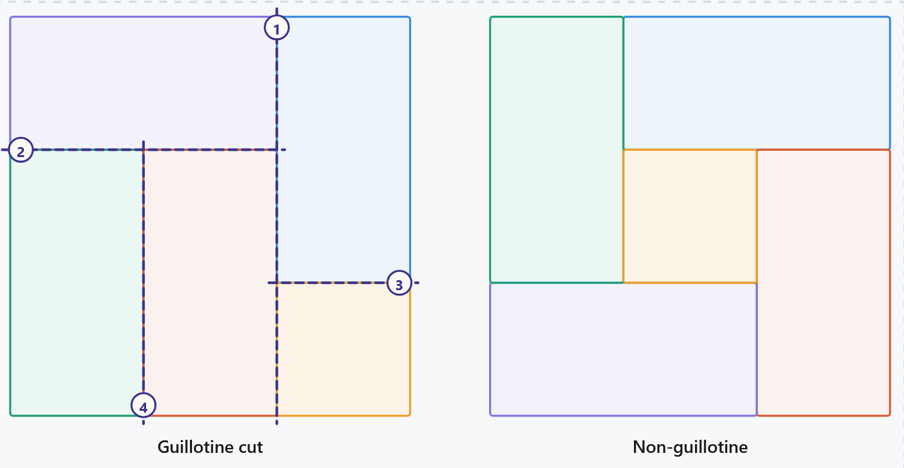
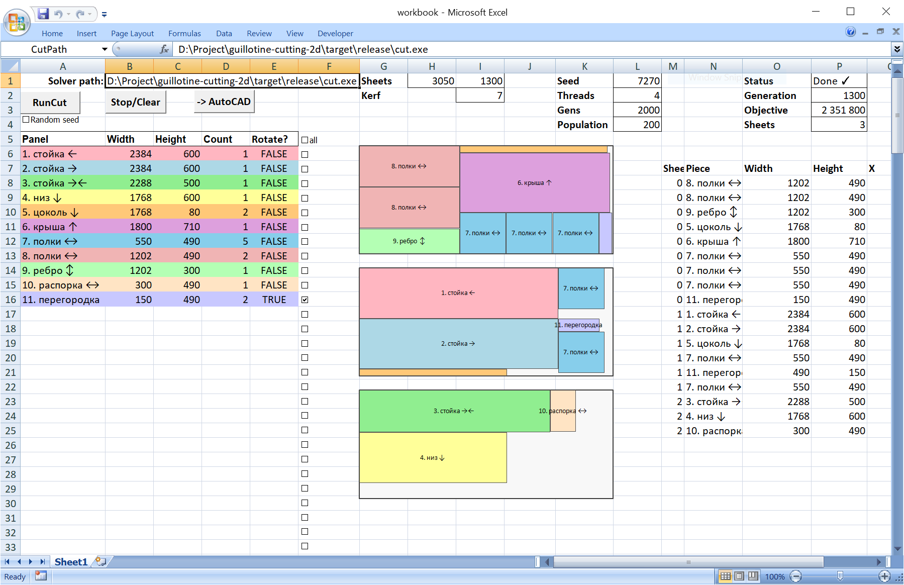

# Guillotine Cutting 2D

Rust library and CLI tool for 2D guillotine cutting stock problems.

## What it does

Given a stock sheet size and a list of rectangular pieces,
the problem is to find placements that minimize the number
of sheets used (ties broken by the secondary metrics to obtain practical cuttings).
Some (or all) pieces can be specified as rotatable.
All cuts are _guillotine_ cuts, i.e. straight lines across the full remaining rectangle.



## Example

The problem is NP-hard, so for large inputs exact computation is infeasible;
the GA finds good approximations instead.

For example, here is the GA improving its solution for a small problem instance.
It takes a significant amount of time to reach a solution using 4 sheets,
since the number of possible solutions is huge and this combinatorics makes the problem hard:


## Distinctive features

- Enforces **guillotine**-cut constraints.
- Supports per-piece **rotation** (rotatable or fixed).
- Three-level lexicographic **Objective**
  `(sheets_used, layout_score, drop_consolidation_score)` — minimizes sheet count first,
  then maximizes concentration of cuts into longer lines, then maximizes
  consolidation of scraps into a few large, reusable leftovers (see [docs/objective.md](docs/objective.md)).
  This is the experimental balance between placement density and practical manufacturability. 
- **Kerf** — blade thickness subtracted from each internal cut; sheet boundary edges are exempt.
  Internally baked into piece and sheet dimensions in `expand_problem`.
- **Margin** — border excluded from all four sheet edges before solving.
  Internally also baked into sheet dimensions in `expand_problem`
- Exact single-sheet optimization via **GLF** (Guillotine Layout Function) — a DP on step functions over
  all guillotine-cut subsets. Supports piece rotation. See GLF visualizer in [Demos/GLF Table Visualizer](#demos)
- Exact **multiple-sheet** optimization via **BPC** (Branch-Price-and-Cut) — column
  generation over cutting patterns priced by the GLF oracle, with branch-and-bound that
  forces pairs of piece types onto the same sheet or apart until the LP relaxation
  matches an integer solution. Minimizes sheet count only (not layout/drop-consolidation
  scores). _Warning_: current performance is poor; exploring approaches to improve it (ﾉ*･ω･)ﾉ.
- **GA** — evolutionary (genetic) algorithm that searches for a good genome. Operators: OX/CX
  crossover, swap/flip/point/inverse mutation. Configured via `GaConfig`. See their visualizations
  in [Demos/GA Crossover; Demos/GA Mutation](#demos)
- **Island-model GA** — `run_ga_mt` spawns one independent island (population) per thread.
  Islands evolve in parallel, synchronizing via a shared barrier every `migration_interval`
  generations. The final result is the best individual found across all islands.
- **Migration** — the mechanism by which islands share progress: at each synchronization
  barrier (every `migration_interval` generations), the best individual across all islands
  overwrites the worst individual on every island, so a strong genome found on one island
  can seed and improve the others.
- Five **Algorithms** (`--algorithm slas|glas|bfdh|jylanki|bpc`, also selectable in the web UI):
  - GA with **SLAS** decoder — one gene per physical piece; SLAS (Shorter Leftover Axis) split heuristic
    (see [docs/slas.md](docs/slas.md)).
  - GA with **GLAS** decoder (default) — Grouped SLAS, one gene per piece *type*;
    pieces grouped into Large / Medium / Small classes so large pieces are always placed first.
    Each batch chooses horizontal or vertical strip (whichever fits more copies) and split direction
    (GA-evolved `inverses` flag). See [docs/glas.md](docs/glas.md).
  - **BFDH** — Best Fit Decreasing Height, greedy shelf heuristic, very fast.
  - **Jylanki** — portfolio greedy packer (per Jylanki's [A Thousand Ways to Pack the Bin.pdf](docs/pdf/A%20Thousand%20Ways%20to%20Pack%20the%20Bin.pdf)):
    runs every combination of sort key x direction x selection rule x split rule
    (144 deterministic passes), keeps the best by `Objective`.
  - **BPC** — exact multi-sheet solver, see above.
- **Genome**:
  - SLAS: `Vec<Gene>` — just the ordered sequence of `Gene`s.
  - GLAS: `Vec<Vec<Gene>>` — outer index = class (0 Large, 1 Medium, 2 Small);
    inner = GA-evolved permutation of type indices. OX/CX crossover and mutation operate
    independently within each class.
- Problem instance **Generator** — creates random problem instances with a known optimal solution.
  Applies guillotine-cut passes to `sheets_count` blank sheets, producing a set of pieces
  that tile those sheets exactly. Useful for benchmarking the GA against a ground truth.
  See the corresponding generator demo in [Demos/Guillotine Generator](#demos).
- **Cross-platform** self-contained console executable — the solver that receives the JSON
  specifying the problem instance and produces JSON with the solution.
  - **`ProblemSpec`** — stock sheet dimensions, blade kerf, margin, and a list of `PieceType` values,
    each with an opaque external label, dimensions, a rotation flag, and a `count`
    (how many copies of that type are needed).
  - **`SolutionSpec`** — vector of `PlacementSpec` (sheet index + piece-type index + position +
    rotation) plus a vector of free rectangles.
- **Not a black box** — the algorithm exposes a progress feedback channel `ProgressSink`
  and cancellation via `GaHandle`.
  - `FifoSink` uses FIFO under Linux (via `mkfifo`).
  - `WindowsPipeSink` uses named pipes under Windows.
  - `StdoutSink` writes progress to stderr and the final JSON result to stdout.
  - Microsoft Excel integration: the executable can be (and is) used as the solver
    in an Excel spreadsheet (or any other external system) thanks to the JSON console interface.
    Autodesk AutoCAD export is also supported.
- The `serve` mode provides an easy way for a local evaluation with visual feedback.


## Usage

- Solve and render in one step with `--render` (SVG written to stdout, progress to stderr):
```
cargo run --release -- calc --compact "2600x1800F:3:400x400/6,495x495/6,270x320/10,150x450/17r" --gens 5000 --render > out.svg
firefox out.svg
```

- If you need the intermediate JSON (e.g. to inspect or re-render), use two commands:
```
cargo run --release -- calc --compact "2600x1800F:3:400x400/6,495x495/6,270x320/10,150x450/17r" --sink stdout --gens 5000 > out.json
cargo run --release -- render --compact "2600x1800F:3:400x400/6,495x495/6,270x320/10,150x450/17r" --solution out.json > out.svg
firefox out.svg
```

- Alternatively, you can pass a JSON file
```
bat -p task.json
  {
    "sheet": {"width": 2600, "height": 1800},
    "kerf": 3,
    "piece_types": [
      {"name": "A", "width": 400, "height": 400, "count": 6, "can_rotate": false},
      {"name": "B", "width": 495, "height": 495, "count": 6, "can_rotate": false},
      {"name": "C", "width": 270, "height": 320, "count": 10, "can_rotate": false},
      {"name": "D", "width": 150, "height": 450, "count": 17, "can_rotate": true}
    ]
  }

cargo run --release -- calc --json task.json --sink stdout --seed 42 --gens 5000
```

- Or you can start the web UI at http://localhost:8080
```
cargo run --release -- serve --port 8080
```

- Or (under Windows) you can run the [Excel workbook](excel/workbook.xls).


- Finally, you can use the library directly:
```rust
use std::sync::Arc;
use cut::{
    ga::GaConfig,
    glas::{decoder::decode_spec, ga::run_ga_mt},
    parse::parse_problem,
};

fn main() {
    let spec = Arc::new(
        parse_problem("3000x4000R:7:835x620/4,1020x620/4f,1750x900").unwrap()
    );
    let cfg = Arc::new(GaConfig { pop_size: 200, n_generations: 1000, ..GaConfig::default() });

    // 8 independent GA islands in parallel;
    // progress_interval=0 (no events), migration_interval=0 (no migration between islands)
    let seeds: Vec<u64> = (0..8).collect();
    let handle = run_ga_mt(Arc::clone(&spec), Arc::clone(&cfg), seeds, 0, 0);

    // Block until all islands finish; results are sorted best-first
    let results = handle.blocking_wait();

    let (best_seed, best_ind) = &results[0];
    let solution = decode_spec(&spec, &best_ind.genome);
    let sheets = solution.sheets_used();
    println!("seed={best_seed}  {sheets} sheet(s)");
}
```

## Compact input format for the parser

`parse_problem` accepts a compact string: `"<sheet>:<kerf>:<pieces>"`.

- `<sheet>` - `WxHR` or `WxHF` in mm; the suffix sets the **default rotation** for pieces:
  - `R` - pieces are rotatable by default
  - `F` - pieces are fixed (no rotation) by default
- `<kerf>` - blade kerf width in mm (non-negative integer)
- `<pieces>` - comma-separated piece tokens; per-piece suffix overrides the sheet default:

| Piece token | Meaning                                        |
|-------------|------------------------------------------------|
| `WxH`       | one piece, rotation = sheet default            |
| `WxH/N`     | N identical pieces, rotation = sheet default   |
| `WxHr`      | one piece, **rotatable** (overrides default)   |
| `WxHf`      | one piece, **fixed** (overrides default)       |
| `WxH/Nr`    | N pieces, rotatable                            |
| `WxH/Nf`    | N pieces, fixed                                |

To control the orientation of a fixed piece, put the shorter side first or last as desired:
`620x1020` places 620 mm along X and 1020 mm along Y.

Examples:
- `"3000x4000R:7:835x620/4,1020x620/4f,1750x900"` - R default; only the `1020x620` batch is fixed
- `"2600x1800F:3:400x400/6,495x495/6,270x320/10,150x450/17r"` - F default; only `150x450` is rotatable


## Development commands

```
cargo build
cargo test
cargo test <test_name>                              # single test
cargo clippy -- -D warnings
cargo +nightly fmt
cargo run --example benchmark --release            # GA + BPC quality benchmark
cargo run --release -- serve --port 8080           # web UI, use http://localhost:8080 to view
```

## Demos

Interactive visualizations (open in browser, no server needed):

(**NOTE**: they are AI-generated from the Rust code and might not be accurate enough)

| Demo                                                                                                    | What it shows                                         |
|---------------------------------------------------------------------------------------------------------|-------------------------------------------------------|
| [SLAS Decoder](https://nlinker.github.io/guillotine-cutting-2d/demos/slas_decoder.html)                 | SLAS genome → sheet placements step by step           |
| [GLAS Decoder](https://nlinker.github.io/guillotine-cutting-2d/demos/glas_decoder.html)                 | GLAS genome → sheet placements step by step           |
| [GLF Table Visualizer](https://nlinker.github.io/guillotine-cutting-2d/demos/glf_table.html)            | GLF DP table build + reconstruction step by step      |
| [GA Crossover](https://nlinker.github.io/guillotine-cutting-2d/demos/ga_ox_cx_gsap.html)                | OX and CX operators animated                          |
| [GA Mutation](https://nlinker.github.io/guillotine-cutting-2d/demos/ga_mutation_gsap.html)              | swap / flip / point-selector mutation animated        |
| [Guillotine Generator](https://nlinker.github.io/guillotine-cutting-2d/demos/guillotine_generator.html) | random problem generation with known optimal solution |

## References

- [Sirazetdinova Tatyana Yuryevna, "Constructing rectangular cutting layouts in computer-aided design systems accounting for defective material regions"](docs/pdf/sirazetdinova_t_u.pdf) —
  The genome and the SLAS decoder in this project are heavily influenced by this thesis. An excellent introduction to the topic.
- [A.A. Andrianova, T.M. Mukhtarova, V.R. Fazylov, "Formation of the Guillotine Cutting Card of a Sheet by the Guillotine Layout Functions"](docs/pdf/159_2_phys_mat_3.pdf) —
  The paper describes _Guillotine Layout Functions_ to compute the exact solution for the cutting problem, we use it from this paper.
- [gdrr-2bp](https://github.com/JeroenGar/gdrr-2bp) — SOTA, a Rust implementation of the goal-driven ruin and
  recreate heuristic for the 2D variable-sized bin packing problem with guillotine constraints.
- [bin-packing](https://github.com/doublesharp/bin-packing) — Rust code with WASM bindings, many heuristics (MaxRects, Skyline, Guillotine beam search), no GA, feature-rich, solid implementation (kerf, trim).
- [cut-optimizer-2d](https://github.com/jasonrhansen/cut-optimizer-2d) — Rust code, GA + GuillotineBin decoder, solid implementation, supports patterns/grain direction tracking. Doesn't support multi-sheet packing for now. 
- [2d-cutting-stock-problem-master](https://github.com/fabiofdsantos/2d-cutting-stock-problem) — Genetic algorithm in Java for 2D packing, no guillotine, no kerf.
- [guillotine-cutting-master](third-party/guillotine-cutting-master) — Simple heuristic in Python, 2D guillotine.
- [gadsky-cutting](third-party/gadsky-cutting) — Cutting algorithm in C++ from Gadsky, has pretty simple GA implementation, but the interesting idea with genome represented by tree.
- [monte-carlo](third-party/monte-carlo) — Monte-Carlo algorithm shows the usage of named pipes for the feedback channel.

