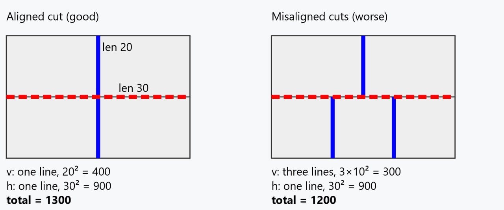

# cut_line_concentration_score

blue = vertical cut line
red dashed = horizontal cut line
(both grouped purely by coordinate)

Difference from `strip_structure_score`: there the key is `(x, w)`/`(y, h)` (it needs
the same column/row of same-size pieces); here the key is just `x`/`y` — it only needs
the *same cut coordinate*, the piece sizes on either side can be anything.

**Left panel**: both the top and bottom row happen to be cut along the same vertical
line `x = 15` — that's one cut spanning the full height (length 20, `20² = 400`), plus
one horizontal cut spanning the full width (length 30, `30² = 900`); total `= 1300`.
**Right panel**: the top row is cut at `x = 15`, but the bottom row is cut at `x = 10`
and `x = 20` instead (a different layout for the bottom row). Even though the combined
length of vertical cuts is actually *longer* here (`10 + 10 + 10 = 30` vs. `20`), the
score is *lower* (`300` vs. `400`, total `1200` vs. `1300`) — because that length is
split into three separate short cuts instead of one long one. This is exactly the point
of squaring: the metric isn't "how much total cutting", it's "how concentrated the
cuts are into a few long lines that need only one fence setting."

## Algorithm

1. For each placement `(x, y, w, h)`, take its internal edges (edges on the sheet
   boundary don't count, same exemption kerf uses): the left edge `x` is a vertical
   cut at coordinate `x` spanning `[y, y+h)`; the right edge `x+w` is a vertical cut at
   coordinate `x+w` with the same span. Symmetrically for the top/bottom edges and
   horizontal cuts.
2. Group all vertical edges by their `x` coordinate, all horizontal edges by their `y`
   coordinate.
3. Within each group (i.e. for one cut coordinate), sort the `[lo, hi)` spans and merge
   the touching/overlapping ones into runs (`sum_squared_runs_by_coordinate` in
   `src/model.rs` — the same helper `strip_structure_score` uses), regardless of which
   piece produced each span.
4. Sum `run_length²` over both axes, then scale by `/10_000` (rounded to the nearest
   integer) to keep values manageable.
