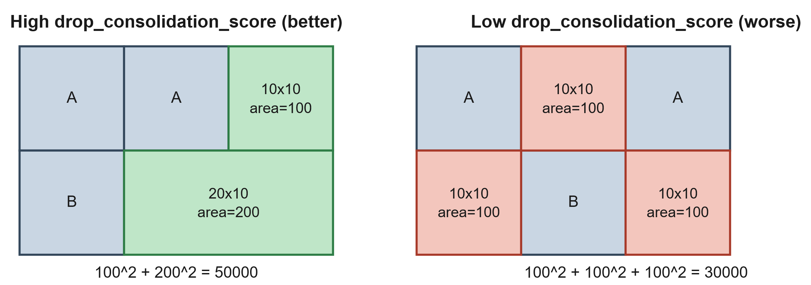

# drop_consolidation_score

This metric rewards layouts whose leftover free area — on the **last sheet only** — is
consolidated into a few large, reusable offcuts rather than fragmented into many small,
unusable scraps.

Why only the last sheet: `sheets_used` (level 1 of the objective) already pressures
every sheet to pack as tightly as physically possible — opening another sheet is
strictly worse regardless of the other levels — so every sheet but the last already has
its leftover pinned to "as little as fits" and isn't a useful drop to optimize for. Only
the final, not-fully-packed sheet has a leftover worth consolidating.

## Algorithm

1. Re-derive the free (unused) region of the last sheet from `placements` alone — not
   from `Solution.leftovers` (the `FreeRect` bookkeeping a decoder happens to produce
   while placing pieces). This matters because guillotine free-space decomposition is
   not unique: SLAS, GLAS, BFDH, ... can each split an identical final set of
   `placements` into differently-shaped `FreeRect` lists, so `Solution.leftovers` is not
   comparable as a single currency across algorithms.
2. Partition the free region into a canonical, disjoint set of horizontal bands:
   y-band boundaries are every placement's top/bottom edge plus `0`/`sheet.height`.
3. Within each band, the placements that fully span it block their `x`-interval; the
   complement of those intervals gives that band's free `x`-intervals (each one a free
   rectangle: band height x interval width).
4. Sum `area^2` over every free rectangle of every band.

Squaring is what rewards consolidation: merging two adjacent free rectangles of areas
`a` and `b` into one of area `a+b` strictly increases the sum
(`(a+b)^2 > a^2+b^2` for `a, b > 0`), so a single big reusable offcut always scores
higher than the same waste fragmented into several small ones — no tunable weight is
needed to express that preference.

`O(p^2)` in the number of placements on the last sheet: a deliberate complexity
trade-off over a faster `O(p log p)` incremental sweep, which would need real
implementation complexity (an active occupied-interval structure maintained across band
boundaries) that isn't justified for the piece counts this GA actually sees.

Idea and partition algorithm ported from a sibling `bin-packing` project's
`two_d::drops::usable_drop_metrics` (sum-of-squares half only; its `min_usable_side`
filter and its separate largest-single-rectangle metric are not adopted here — see
`largest_usable_drop_area` in `docs/objective.md`).

## Example

Sheet 30x20, last sheet only. Both layouts place the same three pieces (two A's and one
B, each 10x10) and therefore leave the same total free area (300), but split it
differently.

**Left panel** — `A` fill the top-left 20x10, `B` fills the bottom-left 10x10. The
free region breaks into two bands: `y=[0,10)` has one free interval of width 10 (area
`10*10 = 100`), and `y=[10,20)` has one free interval of width 20 (area `20*10 = 200`).
Score `= 100^2 + 200^2 = 50000`.

**Right panel** — the same three pieces placed in a checkerboard (A top-left, A
top-right, B in the middle), so the free region splits into three disjoint 10x10 cells
instead: one in the top band (between the two A's) and two in the bottom band (on
either side of B). None of them touch, so none merge. Score
`= 100^2 + 100^2 + 100^2 = 30000`.

Same total leftover area (300), same piece set, but the left layout's leftover is
usable as one 20x10 slab plus one 10x10 scrap, while the right layout's leftover is
three disjoint 10x10 scraps — worse stock for a future cut. That difference in
reusability is exactly what the higher score on the left captures.
