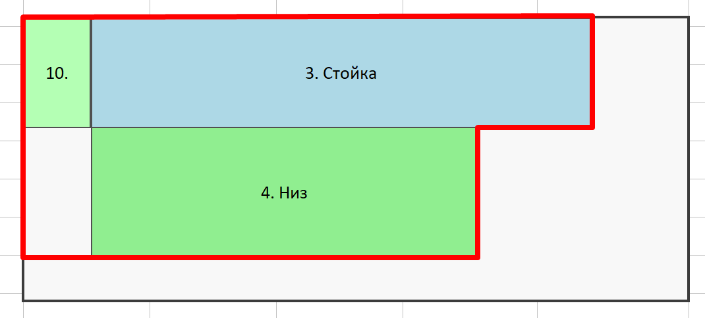
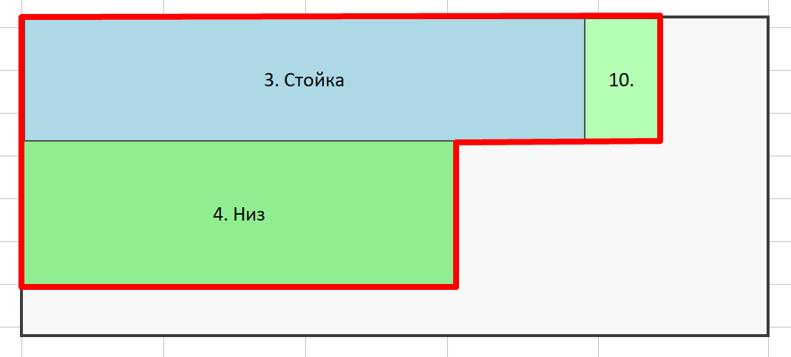

# Objective function

The fitness of a solution is a three-level lexicographic tuple — **lower is better**
(except `layout_score` and `drop_consolidation_score`, which are maximised and
therefore reversed in `Ord`):

| Level | Field                      | Direction    | Meaning                                                                                                                                                                             |
|-------|----------------------------|--------------|-------------------------------------------------------------------------------------------------------------------------------------------------------------------------------------|
| 1     | `sheets_used`              | minimize     | Number of stock sheets consumed. Any *k*-sheet solution is strictly better than any *(k+1)*-sheet solution regardless of the other levels.                                          |
| 2     | `layout_score`             | **maximize** | Cut-line concentration score + strip-structure score (see below). Higher means internal cuts align into a few long, reusable lines and pieces stack into mono-width strips — easier to cut and fewer fence repositions. |
| 3     | `drop_consolidation_score` | **maximize** | Sum of squared areas of the disjoint free-region partition of the **last sheet only**, computed straight from `placements`. Rewards a few large, reusable offcuts over many small scattered scraps. |

---

## drop_consolidation_score

`Solution::drop_consolidation_score` re-derives the free (unused) region of the
**last sheet only** (`sheets_used() - 1`) from `placements` alone — it does **not**
read `Solution.leftovers` (the `FreeRect` bookkeeping a decoder happens to produce
while placing pieces). This matters because guillotine free-space decomposition is not
unique: SLAS, GLAS, BFDH, ... can each split an identical final set of `placements`
into differently-shaped `FreeRect` lists, so `Solution.leftovers` is not comparable as
a single currency across algorithms — the same property that motivates computing
`layout_score` from `placements` (see "How is it being computed?" below).

Why only the last sheet: on a single sheet, total free area splits into
`trapped_waste = staircase_area - placed_area` (pockets boxed in between placed
pieces — pure scrap, see `staircase_area` below) plus
`outer_area = sheet_area - staircase_area` (the region beyond the pieces' bounding
staircase — what's actually reusable as stock). Squaring-and-summing `area²` over
*all* free rectangles of a sheet already prefers small/no trapped pockets plus one big
outer offcut over the same total waste fragmented — no separate weight is needed to
balance the two terms, they're already in the same currency (`area²`). Earlier sheets
don't need this: `sheets_used` (level 1) already pressures every sheet to pack as
tightly as physically possible — opening another sheet is strictly worse regardless of
the other levels — so their leftover is already pinned to "as little as fits" and
isn't a useful drop to optimize for. Only the final, not-fully-packed sheet has a
leftover worth consolidating.

For the last sheet, the free region is partitioned into a canonical, disjoint set of
horizontal strips (y-band boundaries are every placement's top/bottom edge plus
`0`/`sheet.height`; within a band, the placements that fully span it block their
`x`-interval, and the complement gives that band's free `x`-intervals). Each free
rectangle's `area²` is summed.

Squaring is what rewards consolidation: merging two adjacent free rectangles of areas
`a` and `b` into one of area `a+b` strictly increases the sum
(`(a+b)² > a² + b²` for `a, b > 0`), so a single big reusable offcut always scores
higher than the same waste fragmented into several small ones — no tunable weight
needed to express that preference.

```
  High drop_consolidation_score (better)   Low drop_consolidation_score (worse)
  Last sheet only:                         Last sheet only:
  ┌─────────┬─────────┬─────────┐         ┌─────────┬─────────┬─────────┐
  │    A    │    A    │ leftover│         │    A    │    A    │    A    │
  │         │         │  (big)  │         ├─────────┼─────────┼─────────┤
  ├─────────┼─────────┘         │         │    B    │    B    │ scrap   │
  │    B    │                   │         └─────────┴─────────┴─────────┘
  └─────────┴───────────────────┘         Many tiny scraps, none reusable
```

Idea and partition algorithm ported from a sibling `bin-packing` project's
`two_d::drops::usable_drop_metrics` (sum-of-squares half only; its `min_usable_side`
filter and its separate largest-single-rectangle metric are not adopted here — see
`largest_usable_drop_area` below).

`O(p²)` in the number of placements on the last sheet: a deliberate complexity
trade-off over a faster `O(p log p)` incremental sweep, which would need real
implementation complexity (an active occupied-interval structure maintained across band boundaries)
that isn't justified for the piece counts this GA actually sees. Revisit if profiling
says otherwise.

---

## layout_score (cut_line_concentration_score)

A guillotine cut is a single straight line across the full width (or height) of a
rectangular region. In practice this means one fence setting on a panel saw. When
several pieces line up along a common cut, the operator makes one pass and gets
multiple pieces — no fence repositioning needed between them.

The objective therefore needs to distinguish two solutions that use the same number
of sheets and leave the same amount of waste but differ in *how* pieces are grouped:

```
  Good layout                        Bad layout
  ┌─────────┬─────────┬─────────┐   ┌─────────┬─────────┬─────────┐
  │   A     │   A     │   A     │   │   A     │   B     │   A     │
  ├─────────┼─────────┼─────────┤   ├─────────┼─────────┼─────────┤
  │   B     │   B     │   B     │   │   B     │   A     │   B     │
  └─────────┴─────────┴─────────┘   └─────────┴─────────┴─────────┘
  One horizontal cut separates        Every row needs different cuts;
  all A from all B; vertical cuts     horizontal cut cannot be shared
  align across full width.            across the whole sheet.
```

`leftover_area` alone cannot distinguish these two layouts — it only sees waste
rectangles. `layout_score` is the tiebreaker that drives the GA toward manufacturable,
"technological" groupings.

### How it is computed

For each sheet:

1. Take every internal edge of every placed piece (edges lying on the sheet boundary
   are exempt — the same exemption the kerf computation uses).
2. Group vertical edges by their `x` coordinate, horizontal edges by their `y`
   coordinate — each group is a candidate single cut line.
3. Within each group, sort the covered spans and merge overlapping/adjacent ones into
   disjoint runs (a continuous run is one cut the saw can make in a single pass).
4. Add `length²` for every merged run.

The result is summed across all sheets, divided by `100² = 10_000` and rounded to the
nearest integer to keep the numbers in a manageable range.

Squaring is the key: for a fixed total amount of cut length, concentrating it into one
long run scores far higher than spreading it across many short ones (Herfindahl-style
concentration). In the good layout above, the horizontal cut spans the full sheet width
in one run; in the bad layout the same total length is fragmented into several short,
misaligned runs that score much lower when squared individually. This rewards exactly
the "few long, reusable lines" intuition that drives manufacturability — fewer fence
repositions, more pieces cut per pass.

It is also `O(n log n)` per sheet (sort + merge), cheaper than the pairwise `O(n²)`
loop that the previous metric (`shared_edge_score`) used — see
`docs/plans/cut-line-concentration-score.md` for the original brainstorm and the
comparison that motivated the replacement (that metric was pairwise and local, so a
chaotic region could rack up nonzero scores from incidental local matches, and it
could not tell "several pairwise matches on the same coordinate — one continuous,
reusable cut line" from "several unrelated short cuts that add up to a similar total").

## How is it being computed?

Computed from `Solution::placements` after decoding (piece dimensions are in the
expanded flat coordinate system where kerf is already absorbed, so adjacent pieces touch directly).

---

## layout_score, part 2 (strip_structure_score)

The concentration score is blind to *what* lines up along a cut: a strip of pieces
sharing a common side and an incidental alignment of unrelated pieces score the same.
The strip-structure component closes that gap. It rewards **mono-width strips** — stacks
of pieces sharing the same `[x, x+w)` interval laid flush in `y` (plus the symmetric
horizontal runs). Such a strip is ripped with a single fence setting and then chopped
to length, even when the pieces inside it differ — the "block" structure of the
GroupSub decoder (Faizrakhmanov et al., 2014; see
`docs/plans/12_strip-structure-score.md`).

### How it is computed

For each sheet, group placements by their cross-axis interval (`(x, w)` for vertical
runs, `(y, h)` for horizontal), merge flush spans into runs (kerf is absorbed into the
expanded dimensions, so "flush" is exact coordinate equality), and add `length²` per
run. Same merge helper, same `/10_000` scaling as the concentration score.

Squaring is again essential — and here a linear sum would be not just weaker but
*useless*: every placement belongs to exactly one run per orientation, so the total run
length is invariant for a fixed piece set; only the superadditive square distinguishes
consolidated strips from scattered singletons.

A k×m grid of identical w×h pieces scores along both axes at once,
`k·(m·h)² + m·(k·w)²` — the global maximum for that piece set — which is exactly the
incentive that drives the GA toward grids of identical pieces. Mixed pieces sharing a
width still earn partial credit, giving the GA a smoother gradient than an
identical-pieces-only reward.

The two components are summed: `layout_score = concentration + STRIP_WEIGHT · strip`,
with `STRIP_WEIGHT = 1` (both are squared-length sums on the same scale).

---

## staircase_area (implemented, not used in Objective)

`Solution::staircase_area` is implemented (`#[allow(dead_code)]`) but not part of the
current `Objective` and not called at runtime. It may be worth restoring as a secondary
signal or objective level in a future experiment.

The staircase is the Pareto frontier of bottom-right corners `(x + w, y + h)` of all
placed pieces on a sheet, integrated into a step function from the top. It measures how
far pieces stray from the top-left corner — a fully packed sheet has staircase area
equal to the sheet area, and a sparse sheet has a large staircase.

| Large staircase (worse)                         | Small staircase (better)                        |
|-------------------------------------------------|-------------------------------------------------|
|  |  |

Computed per sheet as `Σ x_i · (y_i − y_{i-1})` over the sorted Pareto frontier;
`Solution::staircase_area` returns the maximum across all sheets.

---

## largest_usable_drop_area (implemented, not used in Objective)

`Solution::largest_usable_drop_area` is `drop_consolidation_score`'s sibling — same
decoder-agnostic free-region reconstruction from `placements`, but it reports the area
of the single largest free rectangle instead of the sum of squares. Like
`staircase_area`, it is `#[allow(dead_code)]` and not part of `Objective`: finding it
requires a slab-pair sweep over every pair of y-band boundaries, `O(p³)` per sheet,
which is fine as a one-off report on the final/best solution but too expensive to run
on every individual every generation.
