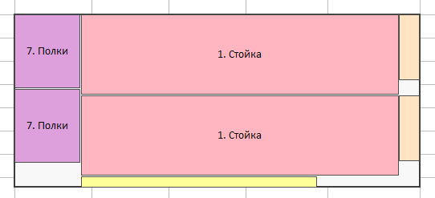
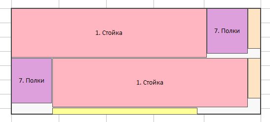

# Objective function

The fitness of a solution is a three-level lexicographic tuple — lower is better:

| Level | Field | Meaning |
|-------|-------|---------|
| 1 | `sheets_used` | Number of stock sheets consumed. Any solution using *k* sheets is strictly better than any solution using *k+1* sheets, regardless of the other levels. |
| 2 | `staircase_area` | Area of the staircase polygon (shown in red below) that encloses all pieces on the **last** sheet. The polygon is the smallest step-shaped region from the origin that covers every placed piece; its area is minimised to compact pieces toward the top-left corner and reduce waste. |
| 3 | `bbox_grouping_penalty` | Sum over groups `(sheet, placed_width, placed_height)` of `bbox_area − piece_area`. Rewards solutions where pieces of the same size and orientation are placed close together, enabling cleaner guillotine cuts across entire rows. |

The staircase polygon is the Pareto frontier of bottom-right piece corners, integrated into a step function.
Smaller area means pieces are packed more tightly toward the origin:

| Large staircase (worse) | Small staircase (better) |
|-------------------------|--------------------------|
|  |  |

The third level distinguishes layouts like the two below, which are equivalent on levels 1–2:

| Good (penalty ≈ 0) | Bad (penalty large) |
|--------------------|---------------------|
|  |  |

In the good layout both shelves form a single column on the left, so one vertical guillotine cut separates
all shelves from all uprights on every row. In the bad layout the shelves are in opposite corners, requiring
different cut patterns per row.
