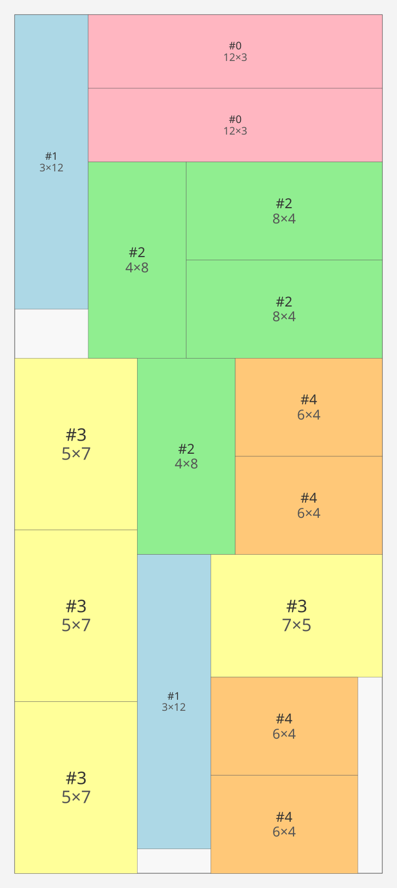
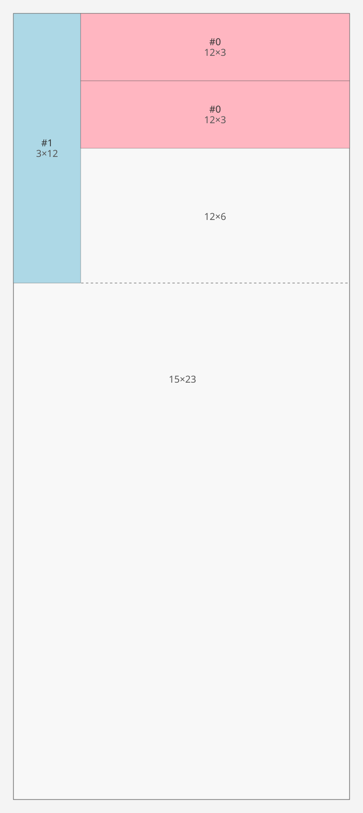
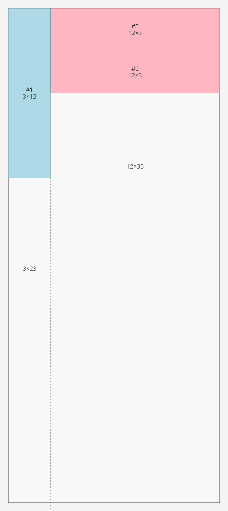

# SLAS — Shorter Leftover Axis Split

After placing a piece `pw × ph` in the top-left corner of a free rectangle `W × H`,
two leftover strips remain. SLAS decides the split direction by comparing their sizes:

```
lw = W - pw   (width  of the right strip)
lh = H - ph   (height of the bottom strip)
```

**If `lw ≤ lh` — horizontal cut:**

```
┌──────────┬──────────┐
│  piece   │  right   │
│  pw × ph │ lw × ph  │
├──────────┴──────────┤
│        bottom       │
│       W  ×  lh      │
└─────────────────────┘
```

**If `lw > lh` — vertical cut:**

```
┌──────────┬──────────┐
│  piece   │          │
│  pw × ph │  right   │
├──────────┤ lw ×  H  │
│  bottom  │          │
│ pw × lh  │          │
└──────────┴──────────┘
```

The rule keeps the wider of the two strips intact.
When `lw` is small (narrow right strip), it is constrained to the piece's height
rather than the full rectangle height — giving the bottom strip the full width.
When `lw` is large (wide right strip), the right strip keeps the full height,
and the narrow bottom strip is constrained to the piece's width.

## When optimal layout cannot be reproduced by SLAS

Let's take the example: GLF optimal 1-sheet solution for `15×35` (piece set from `glf_sweep`):



The SLAS decoder places the first piece — `3×12` — in the top-left corner of the
`15×35` sheet. The split direction is determined by:

```
pw = 3,  ph = 12
lw = 15 - 3  = 12
lh = 35 - 12 = 23
lw ≤ lh, here 12 ≤ 23, therefore horizontal cut
```

| Strip  | Size    | How                                                  |
|--------|---------|------------------------------------------------------|
| Right  | 12 × 12 | lw × ph  (right strip height capped at piece height) |
| Bottom | 15 × 23 | W  × lh  (bottom strip spans full width)             |

The two possible cuts and their consequences after placing the next few pieces:

| Horizontal cut (SLAS, `lw ≤ lh`)                                      | Vertical cut (what GLF needs)                                    |
|-----------------------------------------------------------------------|------------------------------------------------------------------|
|     |  |
| Right strip: **12×12** - only **12×6** remains after two 12×3 pieces  | Right strip: **12×35** - stays tall, room for many more pieces   |
| Bottom strip: **15×23**                                               | Bottom-left strip: **3×23**                                      |

With the horizontal cut the right strip is exhausted after two 12×3 pieces; remaining
tall pieces spill onto a second sheet. `lw=12 ≤ lh=23` forces this branch unconditionally
— SLAS has no way to choose the vertical cut.

`point_selector` only steers which free rect to try first; it cannot override the split
direction. `decode(encode(glf_solution))` therefore uses more sheets than the GLF optimum
whenever the cut trees diverge — the encoder is a warm-start hint for the GA, not an
exact inverse of an arbitrary cut tree.
