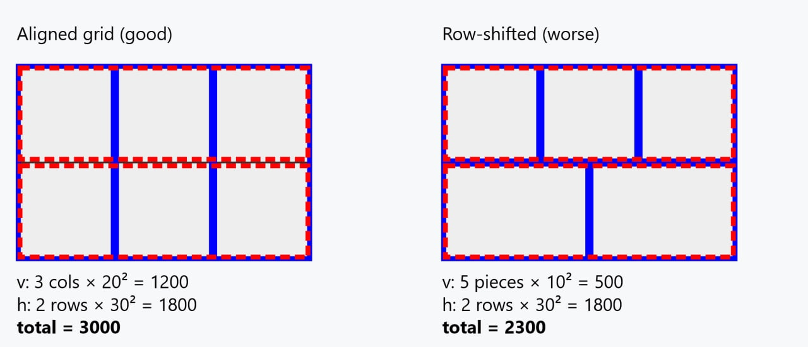

# strip_structure_score

`strip_structure_score` looks for mono-width/mono-height strips: the saw fence is set
once to a piece's width (or height), the whole strip is ripped in a single pass, and
only then chopped crosswise into individual pieces. This differs from
`cut_line_concentration_score`, which only requires the *cut coordinate* to match —
`strip_structure_score` additionally requires the piece *size* to match, i.e. it
literally needs the same column/row of same-width (or same-height) pieces, not just an
incidentally aligned cut.

## Algorithm

1. For each placement `(x, y, w, h)`, build a vertical key `(x, w)` with span `[y, y+h)`.
2. Symmetrically, build a horizontal key `(y, h)` with span `[x, x+w)` for the "row" case.
3. Within each key, sort the spans and merge the touching/overlapping ones into runs
   (same helper, `sum_squared_runs_by_coordinate`, that `cut_line_concentration_score`
   uses).
4. Sum `run_length²` over both axes (same squaring rationale as
   `cut_line_concentration_score` — it rewards a few long runs over many short ones),
   then scale by `/10_000` (rounded to the nearest integer) to keep values manageable.

blue = vertical run (same `x, w`, `y`-spans merged)
red dashed = horizontal run (same `y, h`, `x`-spans merged)

## Worked example

Sheet 30×20.

**Left panel** — a perfect 3×2 grid of 10×10 pieces: each column (`x = 0/10/20`,
`w = 10`) yields one vertical run of length 20 (the two pieces stacked in that column
share `(x, w)` and their `y`-spans touch), and each row (`y = 0/10`, `h = 10`) yields
one horizontal run of length 30. This is exactly the `k·(m·h)² + m·(k·w)²` case from
the doc comment: `3·20² + 2·30² = 1200 + 1800 = 3000`.

**Right panel** — the bottom row is retiled as two 15×10 pieces instead of three
10×10 ones (same total row area, different piece boundaries). The rows are still
mono-height and still merge, so the horizontal part is unchanged (1800). But the
columns break: none of the bottom row's `(x, w)` keys — `(0, 15)`, `(15, 15)` — match
any of the top row's — `(0, 10)`, `(10, 10)`, `(20, 10)` — so all 5 pieces on the sheet
end up as separate, unmerged vertical runs of length 10 (their own height). The
vertical part drops from 1200 to `5 · 10² = 500`, and the total drops from 3000 to
2300. This is the point of the metric: it's not enough for each row to look tidy on
its own — the columns must also stay uniform in width across every row, or the fence
has to be reset more often.
